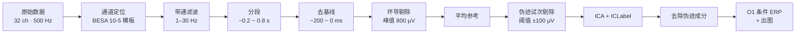

# 🧠 脑电实验设计与时域分析 · EEGLAB ERP Pipeline

<p align="center">
  <b>从 32 导脑电原始数据到事件相关电位（ERP）结果图 · 一条命令复现</b>
</p>

<p align="center">
  
  
  
  
  
  
</p>

> 脑电（EEG）时域分析实验：两名被试在观看 1/2/3/4 段圆弧组成的「对称轴」视觉刺激后按键反应，
> 本项目用 **MATLAB + EEGLAB** 完成从原始数据到 **P2 / N1 事件相关电位（ERP）** 的完整分析，
> 并输出符合实验报告要求的 8 张结果图。

## 目录

- [项目简介](#项目简介)
- [效果预览](#效果预览)
- [核心功能](#核心功能)
- [分析流程](#分析流程)
- [结果](#结果)
- [目录结构](#目录结构)
- [快速开始](#快速开始)
- [输出说明](#输出说明)
- [遇到的问题](#遇到的问题)
- [许可证](#许可证)

## 项目简介

我们的大脑如何处理图形的对称性？本实验让被试观看由 **1 ~ 4 段圆弧**构成的视觉刺激（`1-parts` ~ `4-parts`），
每张图包含不同数量的对称轴，被试需要在 2 s 内按键判断。实验中同步记录 32 导脑电信号。

本仓库完整实现了课程实验要求的分析链路：

- 🎯 **四类刺激条件**：`1-parts → S 31`、`2-parts → S 32`、`3-parts → S 33`、`4-parts → S 34`
- 🧪 **两名被试**：各 393 / 388 个试次，32 通道、500 Hz 采样率
- 📈 **目标信号**：枕区 `O1` 电极的 **N1（约 185 ms）** 与 **P2（约 245 ms）** 成分
- 🖼️ **最终产出**：8 张单条件 ERP 图 + 2 张四条件叠加图 + 成分头皮分布图

## 效果预览

**被试 1（S1）— 四条件叠加**

<img src="https://raw.githubusercontent.com/YangCafeL/eeglab-erp-analysis/main/figures/S1_all4_O1.png" width="49%"

**被试 2（S2）— 四条件叠加**

<img src="https://raw.githubusercontent.com/YangCafeL/eeglab-erp-analysis/main/figures/S2_all4_O1.png" width="49%"

被试 1 表现出清晰、稳定的 **N1–P2 复合波**；被试 2 的早期 **N1 依然存在**，但晚期成分较弱，
这是典型的被试间差异，详见[结果](#结果)一节。

## 核心功能

| 图标 | 功能 | 说明 |
|:---:|---|---|
| 🧹 | **数据清洗流水线** | 通道定位、带通滤波、分段、去基线、坏导剔除、平均参考、伪迹试次剔除 |
| 🧩 | **ICA 去伪迹** | `runica` 分解 + `ICLabel` 自动分类，仅剔除眼电/肌电/心电/线噪等明确伪迹成分 |
| 📉 | **事件相关电位** | 按刺激名称（`S 31` ~ `S 34`）提取 O1 通道平均波形 |
| 🎨 | **一键出图** | 自动生成符合实验报告图例样式的叠加图与单条件图 |
| 📊 | **结果导出** | ERP 时间过程（500 采样点）与峰值统计导出为 CSV，可直接用于报告表格 |
| 🔁 | **完全可复现** | 所有参数写死在脚本里，路径自动推导，换台电脑无需改代码 |

## 分析流程


```mermaid
flowchart LR
    A["原始数据<br/>32 ch · 500 Hz"] --> B["通道定位<br/>BESA 10-5 模板"]
    B --> C["带通滤波<br/>1–30 Hz"]
    C --> D["分段<br/>−0.2 ~ 0.8 s"]
    D --> E["去基线<br/>−200 ~ 0 ms"]
    E --> F["坏导剔除<br/>峰值 800 µV"]
    F --> G["平均参考"]
    G --> H["伪迹试次剔除<br/>阈值 ±100 µV"]
    H --> I["ICA + ICLabel"]
    I --> J["去除伪迹成分"]
    J --> K["O1 条件 ERP<br/>+ 出图"]
```

### 参数一览

| 步骤 | 参数 | 取值 |
|---|---|---|
| 通道定位 | 模板文件 | `standard-10-5-cap385.elp`（BESA） |
| 滤波 | 带通 | **1 – 30 Hz**（FIR，零相位） |
| 分段 | 时间窗 | **−0.2 ~ 0.8 s** |
| 基线 | 区间 | **−200 ~ 0 ms** |
| 坏导判据 | 阈值 | 去基线后单导峰值 **> 800 µV** |
| 参考 | 方式 | **平均参考**（average reference） |
| 试次剔除 | 阈值 | 任一导联 **> ±100 µV** |
| ICA | 算法 | `runica`（extended = 0） |
| 成分剔除 | 规则 | Eye / Muscle / Heart / Line Noise / Channel Noise 概率 **> 0.5** |

## 结果

### 各条件试次数

| 被试 | 31 (1-parts) | 32 (2-parts) | 33 (3-parts) | 34 (4-parts) |
|:---:|:---:|:---:|:---:|:---:|
| S1 | 96 | 98 | 98 | 94 |
| S2 | 74 | 64 | 68 | 76 |

### O1 通道峰值

| 被试 | 条件 | N1 (µV) | 潜伏期 | P2 (µV) | 潜伏期 |
|:---:|:---:|---:|:---:|---:|:---:|
| S1 | 31 | −6.47 | 188 ms | **+9.20** | 248 ms |
| S1 | 32 | −5.35 | 186 ms | **+10.38** | 248 ms |
| S1 | 33 | −5.61 | 182 ms | **+8.93** | 242 ms |
| S1 | 34 | −7.46 | 182 ms | **+9.88** | 242 ms |
| S2 | 31 | −2.03 | 162 ms | +0.56 | 298 ms |
| S2 | 32 | −3.41 | 164 ms | +0.09 | 320 ms |
| S2 | 33 | −3.21 | 174 ms | −0.12 | 226 ms |
| S2 | 34 | −1.75 | 158 ms | +1.57 | 220 ms |

> 💡 **结论**：两名被试在 160 ~ 190 ms 均出现稳定的负向 **N1** 成分；
> 被试 1 的 **P2** 在 245 ms 左右高度一致（约 +9 ~ +10 µV），
> 而被试 2 的晚期成分弱且不稳定，提示其注意/加工资源投入或数据质量存在差异。

单条件结果图位于 `figures/`：`S1_cond31.png` … `S2_cond34.png`（共 8 张）。

## 目录结构

```text
.
├── README.md                     # 本文件
├── LICENSE                       # MIT 许可证
├── .gitignore                    # 忽略大数据 / 课程材料 / 编译产物
├── .gitattributes                # 统一换行符、声明二进制文件
│
├── code/
│   ├── matlab/
│   │   ├── project_paths.m       # 统一路径推导（换机器不用改代码）
│   │   ├── pipeline_final.m      # 主流程：预处理 + ICA + ERP 提取
│   │   ├── plot_results.m        # 绘制 10 张 ERP 结果图
│   │   ├── export_results.m      # 导出 CSV（时间过程 / 峰值统计）
│   │   ├── replot_comps.m        # 重绘成分头皮分布图
│   │   ├── run_all.m             # 一键跑完整流程
│   │   ├── inspect_data.m        # 查看数据集结构
│   │   └── check_s2_channels.m   # 多通道 ERP 对比（数据质控）
│   └── python/
│       ├── extract_text.py       # 提取任务书 / 报告模板文字
│       └── extract_images.py     # 提取 PPT / DOCX 中的图片
│
├── data/                         # ⚠️ 数据不进仓库，见 data/README.md
│   ├── raw/                      # S1.set / S1.fdt / S2.set / S2.fdt
│   └── processed/                # 处理后数据（自动生成）
│
├── figures/                      # 结果图（12 张 PNG）
├── results/                      # ERP 数值结果（CSV + MAT）
└── docs/
    ├── 实验记录与参数说明.md        # 完整处理记录
    └── course-materials/         # 课程材料（默认不公开）
```

## 快速开始

### 1. 环境要求

- **MATLAB** R2019b 或更高（本项目在 **R2024a** 上验证）
- **EEGLAB 2024.2**（[下载地址](https://sccn.ucsd.edu/eeglab/download.php)）
- 内置插件：`dipfit 2.3`（电极模板）、`ICLabel`（成分分类）—— EEGLAB 发行版已自带

### 2. 安装 EEGLAB

```matlab
% 解压后把 EEGLAB 根目录加入路径（注意：只需要根目录，不要加子目录！）
addpath('D:\eeglab\eeglab2024.2');
eeglab;                      % 首次运行会自动建立路径
```

> ⚠️ **踩坑提醒**：EEGLAB 目录不要只比盘根深一层（如 `D:\eeglab2024.2`），
> 否则 `eeglab.m` 的 toolbox 自检会误报「EEGLAB 装在了 MATLAB toolbox 里」。建议放在 `D:\eeglab\eeglab2024.2`。

也可以设置环境变量 `EEGLAB_PATH`，脚本会自动读取：

```powershell
setx EEGLAB_PATH "D:\eeglab\eeglab2024.2"
```

### 3. 获取数据

由于单个 `.fdt` 就有 75 MB，原始数据未上传至仓库。请将数据放置如下：

```text
data/raw/
├── S1.set  S1.fdt      # 被试 1
└── S2.set  S2.fdt      # 被试 2
```

详见 [`data/README.md`](data/README.md)。

### 4. 运行

```matlab
cd code/matlab

run_all            % 一键：预处理 + ICA → 出图 → 导出表格
```

也可以分步执行：

```matlab
pipeline_final     % 预处理 + ICA + 提取 ERP（约 3 分钟）
plot_results       % 生成 10 张结果图
export_results     % 导出 CSV 表格
```

## 输出说明

| 路径 | 内容 |
|---|---|
| `figures/S1_all4_O1.png` · `S2_all4_O1.png` | 四条件叠加图（实验报告图例样式） |
| `figures/S1_cond31.png` … `S2_cond34.png` | 8 张单条件结果图 |
| `figures/S1_ICLabel.png` · `S2_ICLabel.png` | 各成分头皮分布 + ICLabel 判定 |
| `results/ERP_O1_timecourse.csv` | 8 条 ERP 曲线（−200 ~ 800 ms，500 点） |
| `results/ERP_O1_peaks.csv` | N1 / P2 峰值与潜伏期、窗口均值 |
| `results/ERP_results.mat` | MATLAB 结果变量 |
| `data/processed/*.set` | 去伪迹后的数据，可直接在 EEGLAB 中打开复核 |

## 遇到的问题

| 问题 | 现象 | 解决方法 |
|:---:|---|---|
| 🈶 **中文路径** | `pop_loadset` 报「找不到文件或目录」 | 实为脚本编码问题（被 GBK 重写导致路径字符串损坏），**统一用 UTF-8 保存 `.m` 文件** |
| ⚙️ **滤波函数参数** | `pop_eegfiltnew` 报逻辑运算错误 | firfilt 1.6.1 只接受位置参数，应写 `pop_eegfiltnew(EEG, 1, 30)` |
| 🔌 **坏电极** | 被试 2 的 `Fp2` 峰值 3262 µV，污染平均参考 | 先剔除坏导再计算平均参考 |
| 📏 **坏导误判** | 在原始数据上判峰值，把慢漂移当坏导，误删 O1/Oz | 判据必须放在**去基线之后** |
| 🏷️ **ICLabel 过度剔除** | 把 `Other` 类也当伪迹，被试 2 删掉 18/31 个成分 | 只剔除 Eye / Muscle / Heart / Line Noise / Channel Noise |

更完整的记录见 [`docs/实验记录与参数说明.md`](docs/实验记录与参数说明.md)。

## 许可证

本项目基于 [MIT License](LICENSE) 开源。

课程材料（`docs/course-materials/`）由授课教师提供，**不在开源许可范围内**，已通过 `.gitignore` 排除。

## 参考

- Delorme, A., & Makeig, S. (2004). *EEGLAB: an open source toolbox for analysis of single-trial EEG dynamics*. Journal of Neuroscience Methods, 134(1), 9–21.
- Pion-Tonachini, L., Kreutz-Delgado, K., & Makeig, S. (2019). *ICLabel: An automated electroencephalographic independent component classifier, dataset, and website*. NeuroImage, 198, 181–197.
